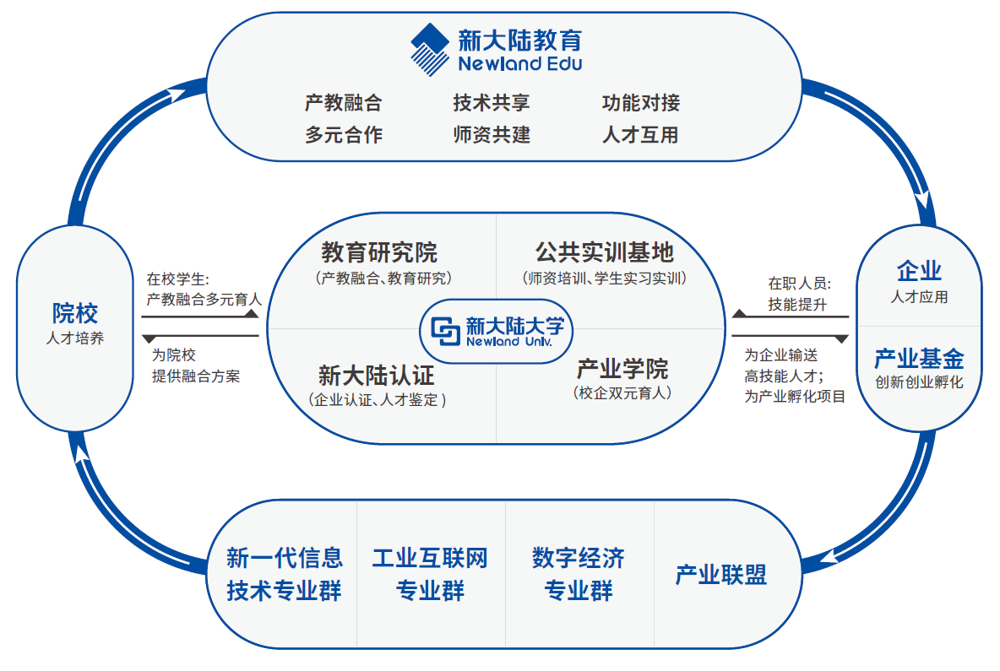

# 新大陆教育公司

新大陆教育以最新的人才培养理念、优质的教育教学资源、国內外新兴教硏模式，打造全新的产教融合、校企合作人才培养的教育生态链。助力泰国“鲁班工坊”、柬埔寨“鲁班工坊”建设，辐射一带一路沿线国家，搭建起中国教育与世界沟通的桥梁。

## 公共资源

物联网竞赛资源包括各种针对物联网领域的竞赛提供的资源，这些资源可以帮助参赛者更好地参与竞赛。这些资源可能包括数据集、开源代码、评测工具、学习资料等。
使用这些资源可以帮助参赛者更好地理解竞赛要求，并且可以提高参赛者的竞争能力。
同样，希望它是一个由社区驱动和维护的项目，使更多人能够一起做一个有趣的仓库。所以非常欢迎大家贡献它~。

## 如何贡献

针对发现的问题，直接修改并提交 Pull request 即可。

在写创意题时，请复制并修改已有的模板:[示例模版](./物联网竞赛/创意题库/创意题示例/示例模板.md)。

## 物联网竞赛

- [创意题库](./物联网竞赛/创意题库)
- [历年国赛任务书](./物联网竞赛/历年国赛任务书)

## 1+X职业技能等级

- [传感网应用开发](./1+X职业技能等级/传感网应用开发/传感网应用开发.md)
- [物联网安装调试员](./1+X职业技能等级/物联网安装调试员/物联网安装调试员.md)
- [物联网实施与运维](./1+X职业技能等级/物联网实施与运维/物联网实施与运维.md)
